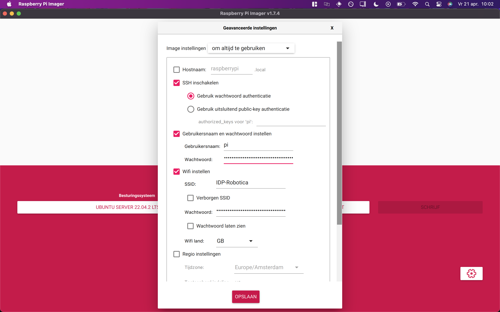

# Using Advanced Options

The Advanced options menu allows you to preconfigure a variety of network settings that would previously have required manual editing after flashing the SD card.

Here you can setup the WiFi connection and enable SSH, allowing you to connect to your Pi remotely.

Make sure that the following settings are correct:

1. SSH is checked and using password authentication
2. The username of the Raspberry is "pi" and the password is set to the agreed password of your robotics group.
3. The WiFi SSID and password are filled in correctly, so you can connect with the robotics network.

Once you have entered your details, click "Save" and then "Write" to flash your SD card!

Eject your SD card and insert it into your Raspberry Pi to continue to the next step.