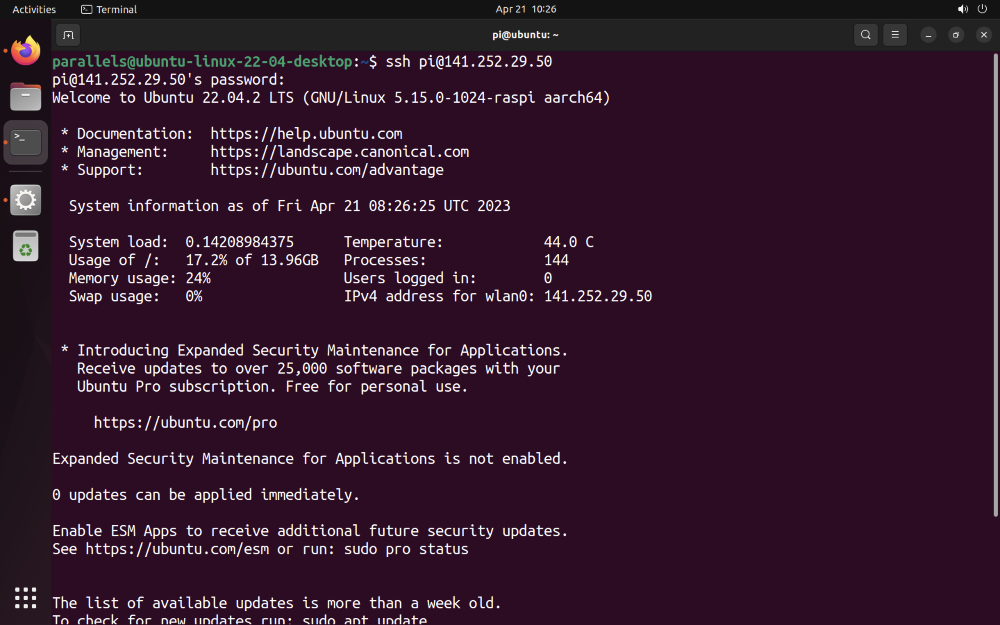

# Boot Ubuntu Server

If you are using an HDMI screen and a USB keyboard, ensure they are plugged in before powering on the Pi. You will be able to see the boot process on the screen.

## Connect remotely to your Raspberry Pi

To connect to your Raspberry Pi remotely, you need two things

- It's IP address on the robotics network (This IP is static and you should already have this)
- An SSH client

### Using an SSH client

On Ubuntu and Mac OS, an SSH client is already installed. If you are on Windows you can either use Ubuntu on WSL or the built-in SSH client in the Windows terminal.

Open a terminal and run the following command:

ssh <username>@<Raspberry Pi’s IP address>

or

ssh <username>@<hostname>

If you set one up in the Advanced options menu.

You will be asked to confirm the connection:

Are you sure you want to continue connecting (yes/no/[fingerprint])?

Type “yes” to confirm. You will then be asked to sign in with your username and password

Success! You are now connected to Ubuntu Server running on your Raspberry Pi.