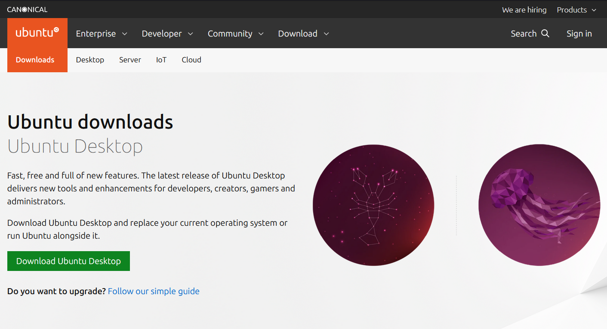
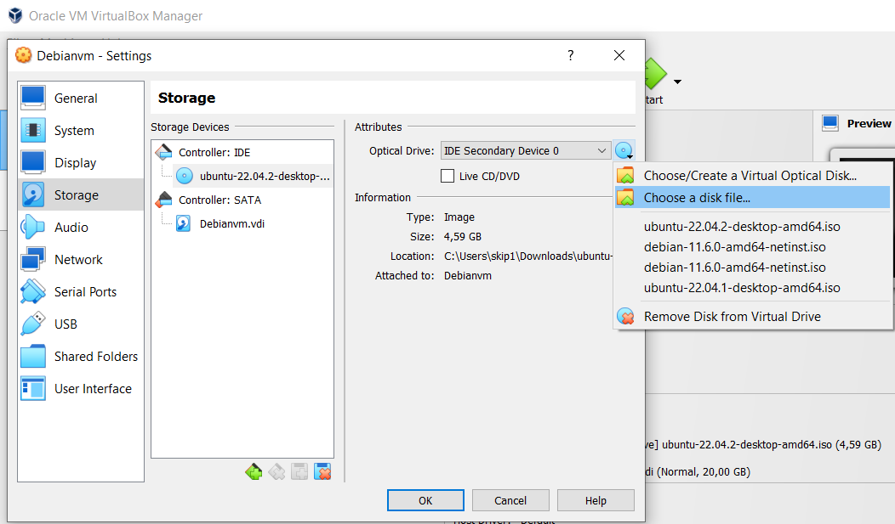
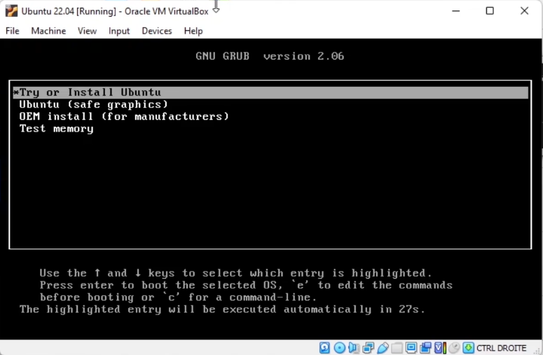
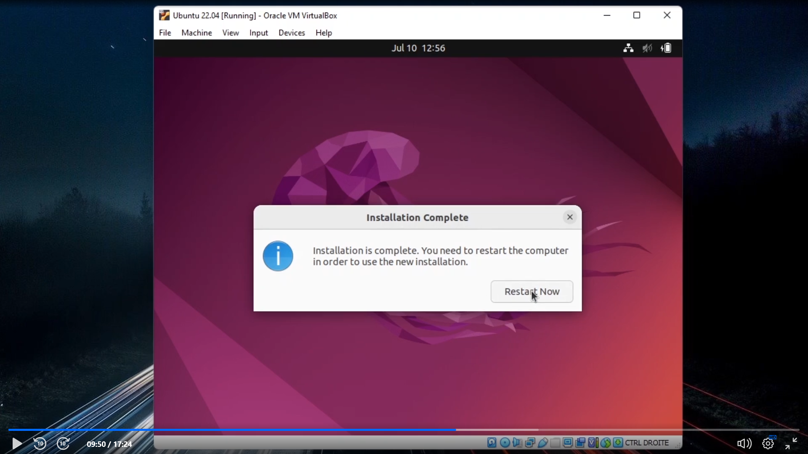

# Install Ubuntu 22.04 on a Virtual Machine

This guide assumes you have a virtual machine installed on your computer (via 
VirtualBox or a similar program) and you want to install Ubuntu 22.04 on it.

## Download Ubuntu 22.04

First download the correct Ubuntu 22.04 iso file for your system from the Ubuntu website.

[Ubuntu download link](https://ubuntu.com/download)

## Add Ubuntu .iso to Virtual Machine

Go to your VM's settings and then to storage. Then add the Ubuntu iso file to your Virtual Machine by selecting the file on your disk.

## Install Ubuntu 22.04

Now it's time to launch the VM, you should see the following:

Go through the following steps:

- Select 'Try or Install Ubuntu' on the first screen you see
- Next select 'Install Ubuntu'
- Then select your keyboard layout
- Normal or minimal installation is up to preference
- Next select 'Erase disk and install Ubuntu'
- Select your timezone
- Choose a username and password

Wait for the installation to complete.

Once it's complete you should see the following:

Press 'Restart now' and press Enter when prompted on the next startup.

## Update Ubuntu 22.04

Now that Ubuntu is installed it's time to get it up to date.

Run the following commands in the terminal to do so:

- sudo apt update
- sudo apt upgrade
- sudo apt autoremove

Your Ubuntu  is now installed and up to date!

