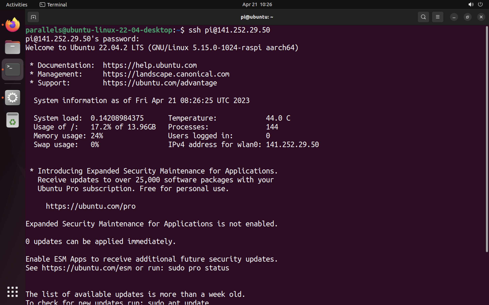

# Overview

We walk you through the process of installing Ubuntu Server on a Raspberry Pi, connecting it to the robotics network and using it remotely.

## What you'll need

1. A microSD card (8GB minimum, more is recommended)

2. A computer with a microSD card drive

3. A Raspberry Pi 3 or 4

4. A micro-USB power cable (USB-C for the Pi 4)

5. Access to the robotics Wi-Fi network (Provided by school)

# Prepare the SD Card

First, insert the microSD card into your computer.

Now you need to install the rioght raspberry Pi Imager for your operating system. You can do this with the following links:

- [Raspberry Pi Imager for Ubuntu](https://downloads.raspberrypi.org/imager/imager_latest_amd64.deb)
- [Raspberry Pi Imager for Windows](https://downloads.raspberrypi.org/imager/imager_latest.exe)
- [Raspberry Pi Imager for macOS](https://downloads.raspberrypi.org/imager/imager_latest.dmg)

Once you downloaded the correct version for your operating system, start the Imager and open the "CHOOSE OS" menu.

Scroll down the menu click “Other general-purpose OS”.

Select Ubuntu

Here you you can select Ubuntu and see a list of download options. For robotics project we need you to select the latest Ubuntu 22.04 LTS server for 64 bit architectures.

Select the image and open the “Choose Storage” menu. Select the microSD card you have inserted.

Before clicking ‘Write’ to flash your SD Card, click the cog icon to open a settings menu for advanced options.

# Using Advanced Options

The Advanced options menu allows you to preconfigure a variety of network settings that would previously have required manual editing after flashing the SD card.

Here you can setup the WiFi connection and enable SSH, allowing you to connect to your Pi remotely.

Make sure that the following settings are correct:

1. SSH is checked and using password authentication
2. The username of the Raspberry is "pi" and the password is set to the agreed password of your robotics group.
3. The WiFi SSID and password are filled in correctly, so you can connect with the robotics network.

Once you have entered your details, click "Save" and then "Write" to flash your SD card!

Eject your SD card and insert it into your Raspberry Pi to continue to the next step.

# Boot Ubuntu Server

If you are using an HDMI screen and a USB keyboard, ensure they are plugged in before powering on the Pi. You will be able to see the boot process on the screen.

## Connect remotely to your Raspberry Pi

To connect to your Raspberry Pi remotely, you need two things

- It's IP address on the robotics network (This IP is static and you should already have this)
- An SSH client

## Using an SSH client

On Ubuntu and Mac OS, an SSH client is already installed. If you are on Windows you can either use Ubuntu on WSL or the built-in SSH client in the Windows terminal.

Open a terminal and run the following command:

ssh <username>@<Raspberry Pi’s IP address>

or

ssh <username>@<hostname>

If you set one up in the Advanced options menu.

You will be asked to confirm the connection:

Are you sure you want to continue connecting (yes/no/[fingerprint])?

Type “yes” to confirm. You will then be asked to sign in with your username and password

Success! You are now connected to Ubuntu Server running on your Raspberry Pi.